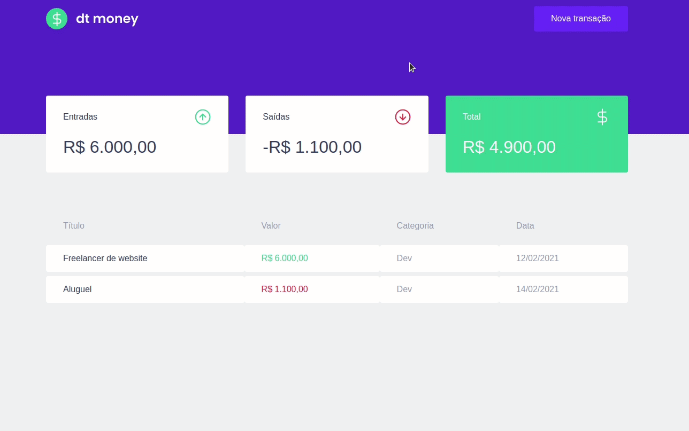

# dtMoney

## Descrição do Projeto

<p align="center">dtMoney é um simples gerenciador de finanças desenvolvido conforme metodologia da rocketseat com fins educacionais. Neste projeto foram utilizados uma variedade de bibliotecas, como styled-components, miragejs, axios, react-modal.</p>


<p align="center">
 <a href="#objetivo">Objetivo</a> •
 <a href="#roadmap">Roadmap</a> • 
 <a href="#tecnologias">Tecnologias</a> • 
 <a href="#contribuicao">Contribuição</a> • 
 <a href="#licença">Licença</a> • 
 <a href="#autor">Autor</a>
</p>

<h4 align="center"> 
	🚧  React Select 🚀 Concluído...  🚧
</h4>


### Features

- [x] Cadastro de transações
- [x] Dashboard
- [x] Sumarização das informações


### Demosntração

<h1 align="center">
  
</h1>

### Pré-requisitos

Antes de começar, você vai precisar ter instalado em sua máquina as seguintes ferramentas:
[Git](https://git-scm.com), [Node.js](https://nodejs.org/en/). 
Além disto é bom ter um editor para trabalhar com o código como [VSCode](https://code.visualstudio.com/)

### 🎲 Rodando a aplicação

```bash
# Clone este repositório
$ git clone <https://github.com/fredzstevanato/IGNITE-REACT-Chapter-02-dtMoney.git>

# Acesse a pasta do projeto no terminal/cmd
$ cd IGNITE-REACT-Chapter-02-dtMoney

# Instale as dependências
$ yarn

# Execute a aplicação em modo de desenvolvimento
$ yarn start

# O servidor inciará na porta:3000 - acesse <http://localhost:3000>

```

### 🛠 Tecnologias

As seguintes ferramentas foram usadas na construção do projeto:

- [miragejs](https://miragejs.com/)
- [React](https://pt-br.reactjs.org/)
- [TypeScript](https://www.typescriptlang.org/)


### Autor
---

<a href="https://github.com/fredzstevanato">
 
 <br />
 <sub><b>Frederico Stevanato Rocha</b></sub></a>🚀</a>


Feito com ❤️ por Frederico Stevanato Rocha 👋🏽 Entre em contato!

[](https://www.linkedin.com/in/fredzstevanato/) 
[](mailto:fredzstevanato@gmail.com)